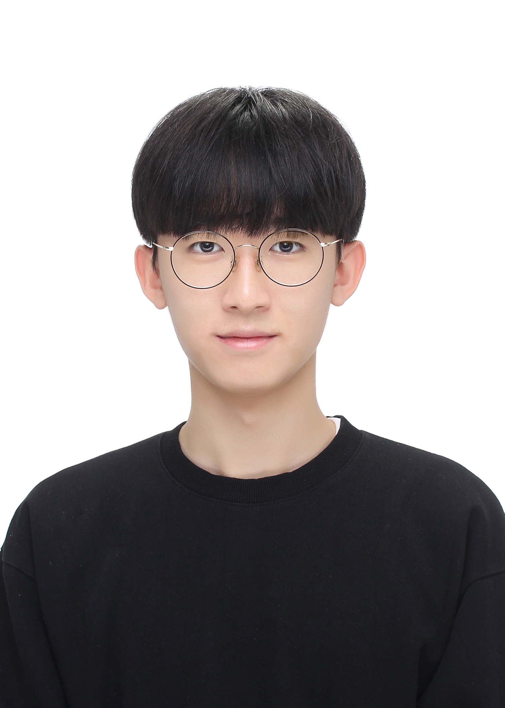

<link href="https://fonts.googleapis.com/css2?family=Ubuntu+Mono&display=swap" rel="stylesheet">

{: width="250px" }

## About Me

Hi, I'm **Hyukjun Kwon**, an undergraduate student in Seoul National University interested in privacy-preserving technologies and verifiable computing.
I'm currently exploring on the field of Differential Privacy and Zero Knowledge Proofs.

---

## Education

- **Seoul National University** (Mar. 2020 – Aug. 2026, expected)  
  B.S. in Computer Science and Engineering

---

## Experience

- **Seoul National University** (Jan. 2025 – Present)  
  Undergraduate Research Assistant  
  Advisor: Prof. [Chenglin Fan](https://sites.google.com/site/chenglinfanresearch/welcome-to-chenglin-fans-webpage)

---

## Publications

- Hyukjun Kwon, Chenglin Fan.  
  "**Verifying Differentially Private Median Estimation**"  
  [[arXiv]](https://arxiv.org/abs/2505.16246#)

---

## News

- May 2025: My first paper is posted on arXiv!
- Jan 2025: Joined professor [Chenglin Fan](https://sites.google.com/site/chenglinfanresearch/welcome-to-chenglin-fans-webpage)'s [AFD lab](https://sites.google.com/snu.ac.kr/afdlab/%ED%99%88?authuser=0) as a research intern!

---

## Contact Information

- Email: todd4@snu.ac.kr
- Office: 302-317, Seoul National University

---
