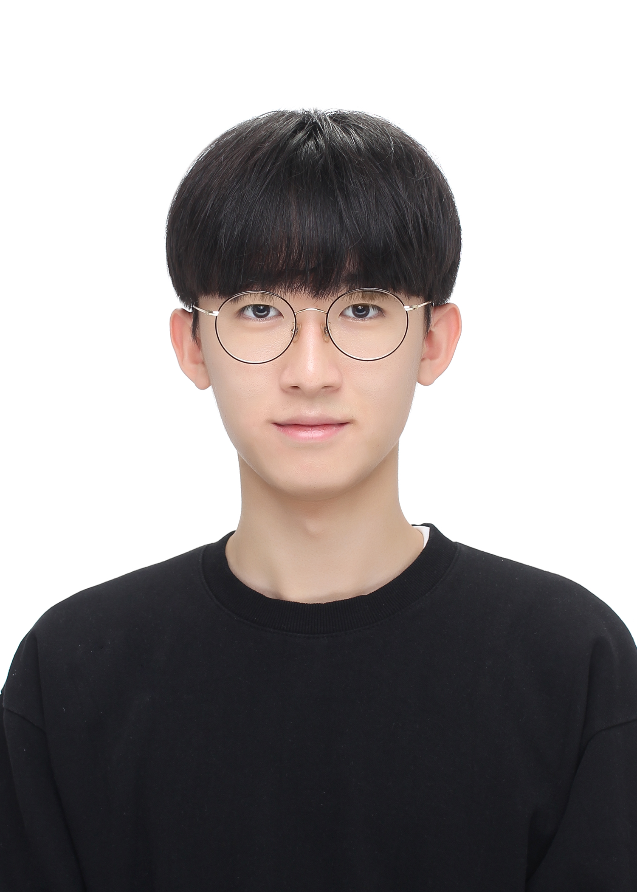

<link href="https://fonts.googleapis.com/css2?family=Ubuntu+Mono&display=swap" rel="stylesheet">

{: width="250px" }

- Email: todd4@snu.ac.kr
- GitHub: [Hyoek-Jun-Kwon](https://github.com/Hyoek-Jun-Kwon)
- LinkedIn: [Hyukjun Kwon](https://www.linkedin.com/in/hyukjun-kwon-35908736a/)

## About Me

Hi, I'm **Hyukjun Kwon**, an undergraduate student at Seoul National University.
My current research interests lie in recommendation systems.

*(Previously, I have worked on differential privacy and verifiable computation.)*

---

## Education

- **Seoul National University** (Mar. 2020 – Aug. 2026, Expected)  
  B.S. in Computer Science and Engineering

---

## Experience

- **[VIP Lab](https://vip.snu.ac.kr/index.html) @ Seoul National University** (Mar. 2025 – Present)  
  
  Undergraduate Research Intern
  *(Advisor: Prof. [Joonseok Lee](http://www.joonseok.net/home.html))*
  
  
  - Research on Multi-interest Recommendation

- **[AFD Lab](https://sites.google.com/snu.ac.kr/afdlabsnu/afd-lab?authuser=0) @ Seoul National University** (Jan. 2025 – Dec. 2025)  
  
  Undergraduate Research Intern
  *(Advisor: Prof. [Chenglin Fan](https://sites.google.com/site/chenglinfanresearch/welcome-to-chenglin-fans-webpage))*
  
  
  - Research on Differential Privacy and Verifiable Computing

---

## Preprints

- ***Hyukjun Kwon***, Chenglin Fan.  
  "**Verifiable Exponential Mechanism for Median Estimation**"  
  [[arXiv]](https://arxiv.org/abs/2505.16246v2)

---

## News

- Mar 2026: Joined [VIP lab](https://vip.snu.ac.kr/index.html) as an undergraduate research intern.
- Jan 2026: I will be joining a mentoring program at professor [Joonseok Lee](http://www.joonseok.net/home.html)'s [VIP lab](https://vip.snu.ac.kr/index.html). I look forward to the challenge and hope to gain essential skills in AI/ML for visual understanding and recommendation through this program!
- May 2025: My first paper is posted on arXiv!
- Jan 2025: Joined professor [Chenglin Fan](https://sites.google.com/site/chenglinfanresearch/welcome-to-chenglin-fans-webpage)'s [AFD lab](https://sites.google.com/snu.ac.kr/afdlab/%ED%99%88?authuser=0) as a research intern!

---
